# Microsoft Defender XDR Fundamentals — Professional Cybersecurity Technical Analysis

## 1. Context: What Area This Touches & Why It Matters

Modern endpoint security involves more than detecting malware. Security teams need a way to connect alerts, devices, users, processes, network activity, and other evidence so they can understand what actually happened.

Microsoft Defender XDR provides this type of centralized visibility. It allows an analyst to move from a high-level incident into the individual alert, affected device, user, supporting evidence, and endpoint activity surrounding the detection.

This matters because an alert by itself does not always explain whether activity is malicious, expected, or simply unusual. The surrounding context is what helps an analyst make a reasonable decision.

---

## 2. Realistic Scenario: When This Knowledge Is Useful

A realistic situation would be a security analyst reviewing a medium-severity incident involving a suspicious PowerShell command line.

PowerShell is commonly used for normal administration, automation, troubleshooting, and security operations. It is also frequently abused by attackers. Because of that, simply seeing `powershell.exe` in an alert would not be enough to determine whether a system was compromised.

The question would be:

> Was PowerShell being used for legitimate activity, controlled testing, or behavior that needed further investigation?

The analyst would need to review the incident, affected assets, process relationships, command-line activity, timeline events, and other evidence before making a decision.

---

## 3. Thinking Process: How I Approached the Problem

I started by making sure the endpoint security components were actually working before trusting the information in the Defender portal.

The Microsoft Defender for Endpoint `Sense` service was running, and Microsoft Defender Antivirus showed that major protections such as antivirus, behavior monitoring, real-time protection, and tamper protection were enabled.

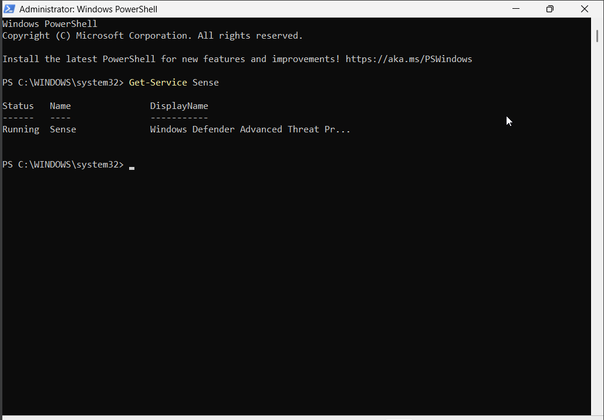

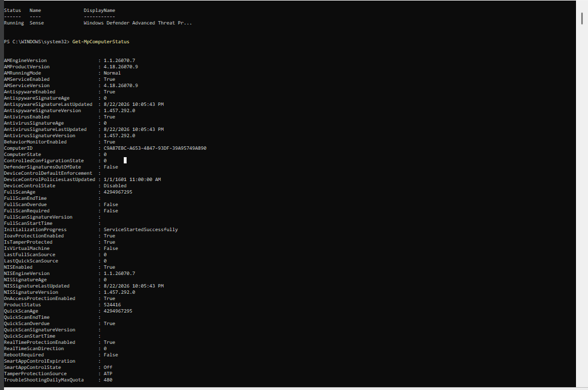

After confirming the endpoint was operating correctly, I moved into Microsoft Defender XDR.

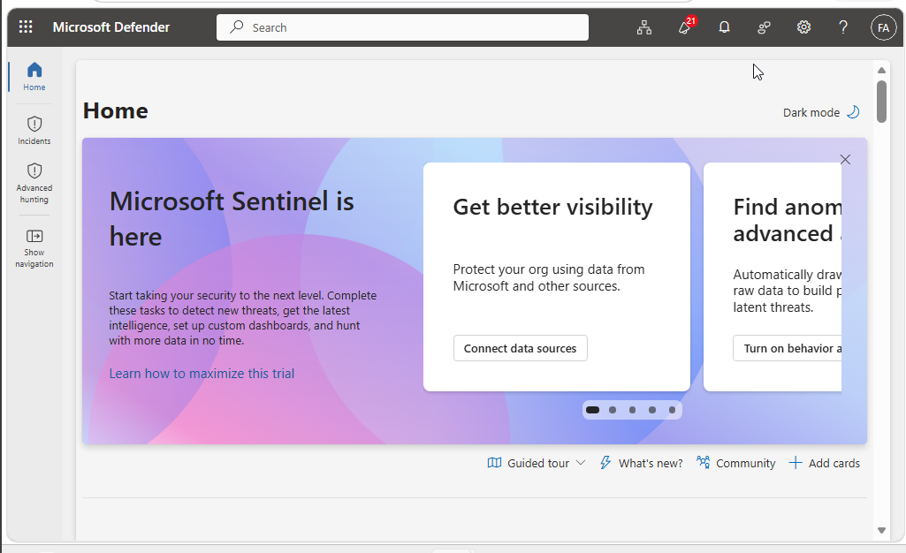

One issue I ran into was that the Incident Queue initially showed zero incidents. At first, this could have looked like there was simply nothing available to investigate. Instead of assuming the tenant had no security data, I checked the filtering and time range.

The queue was originally limited to a shorter period. Expanding the view to 30 days revealed two medium-severity incidents:

* `Suspicious PowerShell command line`
* `Execution incident on one endpoint`

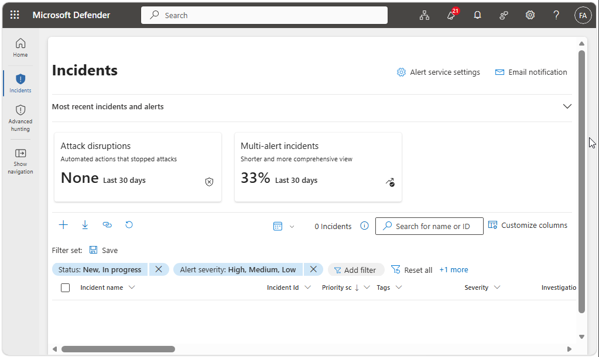

That was an important reminder that investigation results depend on how the data is filtered. Relevant evidence can appear missing when the search scope is too narrow.

I then focused on the `Suspicious PowerShell command line` incident.

Before deciding what the alert meant, I reviewed the affected endpoint and its security context. Defender showed the Windows device as onboarded and connected to active security information.

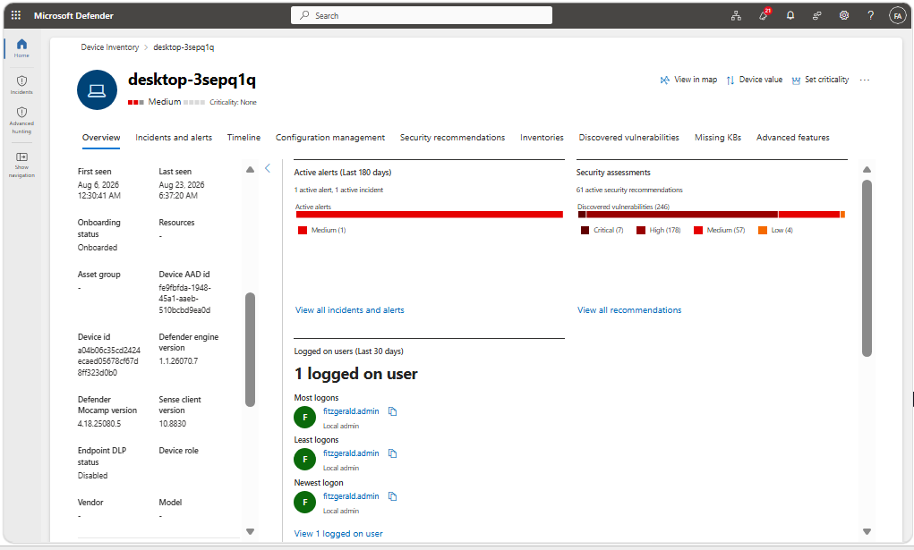

I then used the Device Timeline to review events surrounding PowerShell activity instead of judging the incident only from its title.

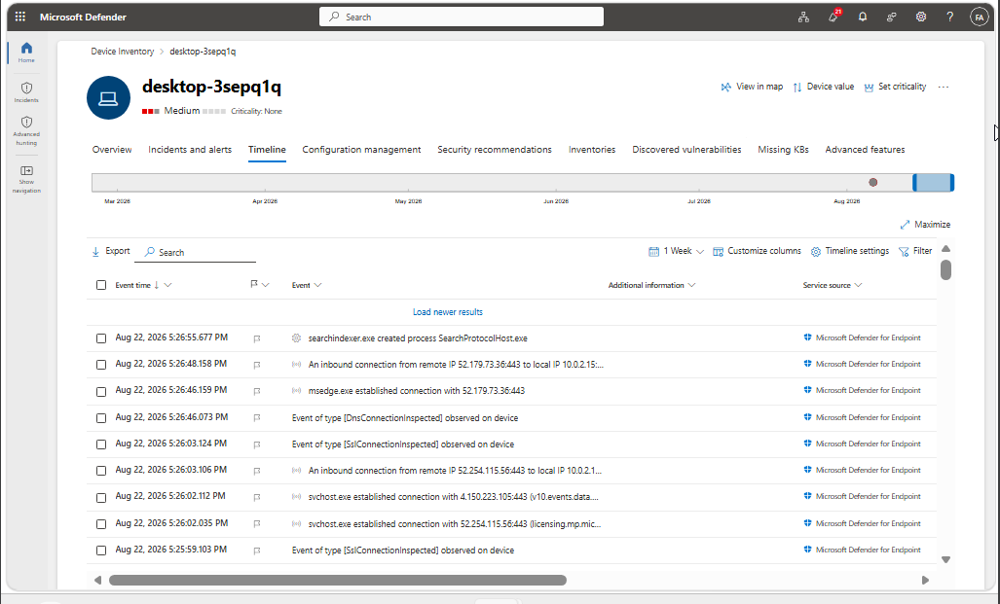

The timeline showed process activity, network events, PowerShell behavior, file creation, and several anomalous memory-allocation events. I opened individual events to understand the process relationships.

The process context was especially useful. I observed relationships involving:

`MsSense.exe → SenseIR.exe → powershell.exe → csc.exe`

and additional child-process activity involving `csc.exe`.

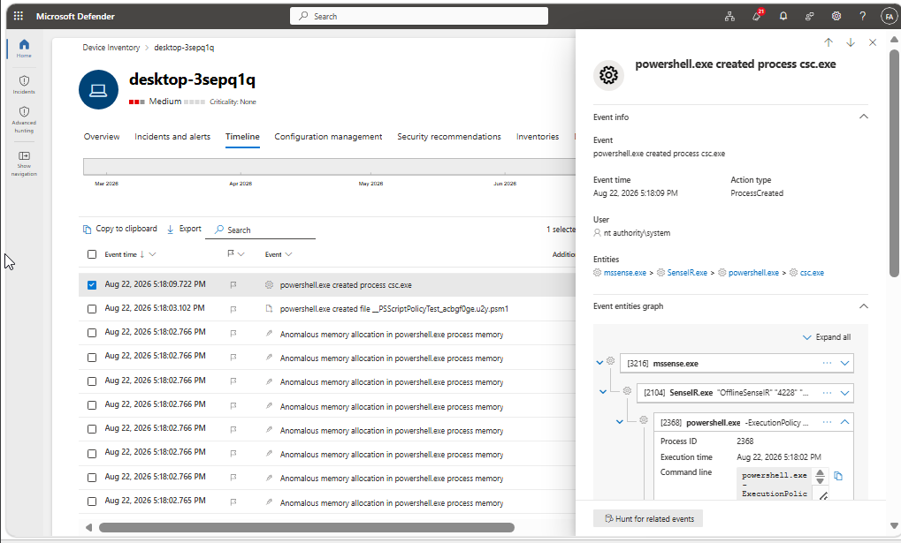

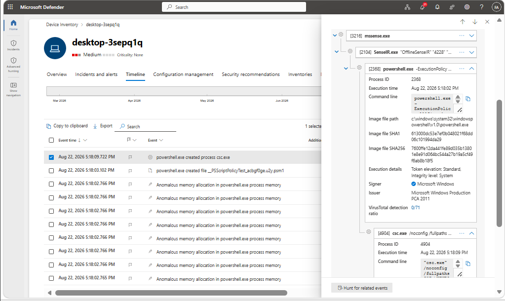

This changed how I interpreted the PowerShell activity. Seeing PowerShell alone could have looked immediately suspicious, but the parent processes included Microsoft Defender components. That meant I needed to avoid making a quick conclusion based only on the process name.

I continued by reviewing detailed timeline events and then connected that endpoint activity back to the incident.

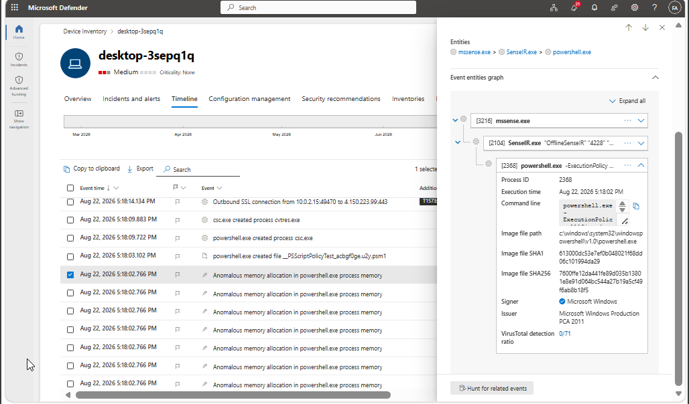

The incident view showed that the PowerShell activity was connected to a medium-severity security case rather than existing as an isolated endpoint event.

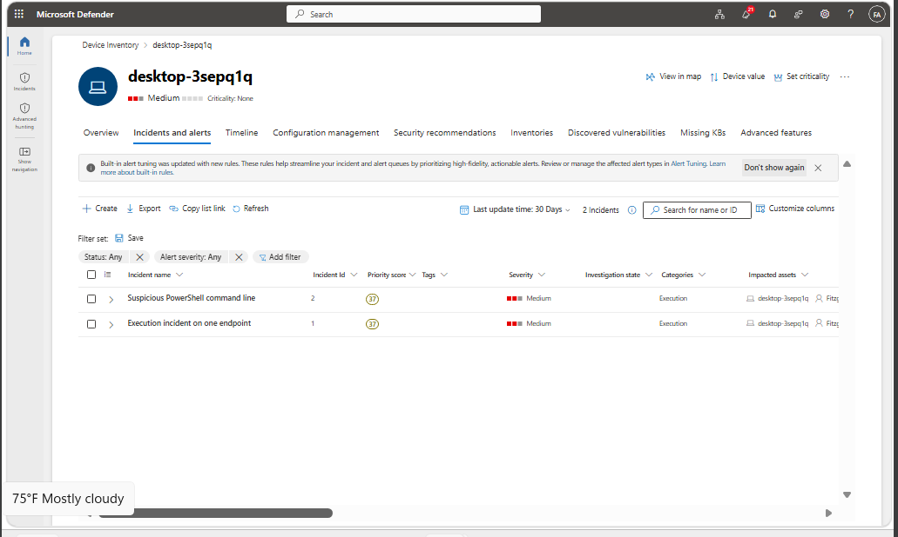

From there, the Attack Story helped connect the device, user, PowerShell activity, and localhost network information into one investigation view.

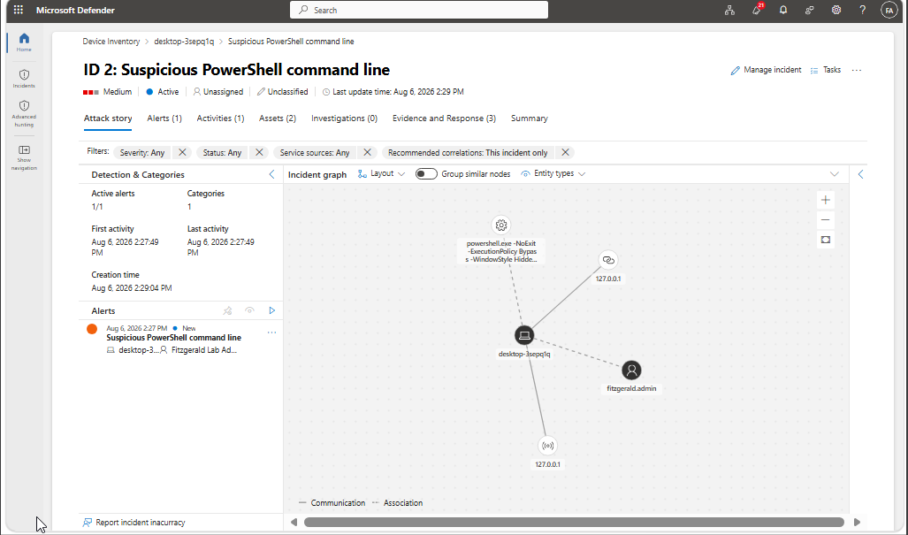

I also reviewed the affected assets instead of focusing only on the process.

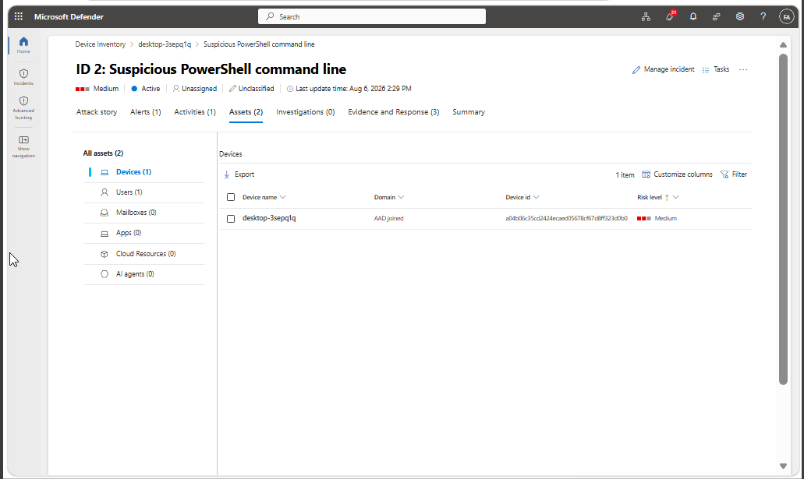

The incident contained both a device and a user entity, which reinforced the idea that an XDR investigation can move between endpoint and identity context.

The Evidence and Response section provided three main pieces of suspicious evidence:

* a `powershell.exe` process
* the URL `http://127.0.0.1/1.exe`
* the IP address `127.0.0.1`

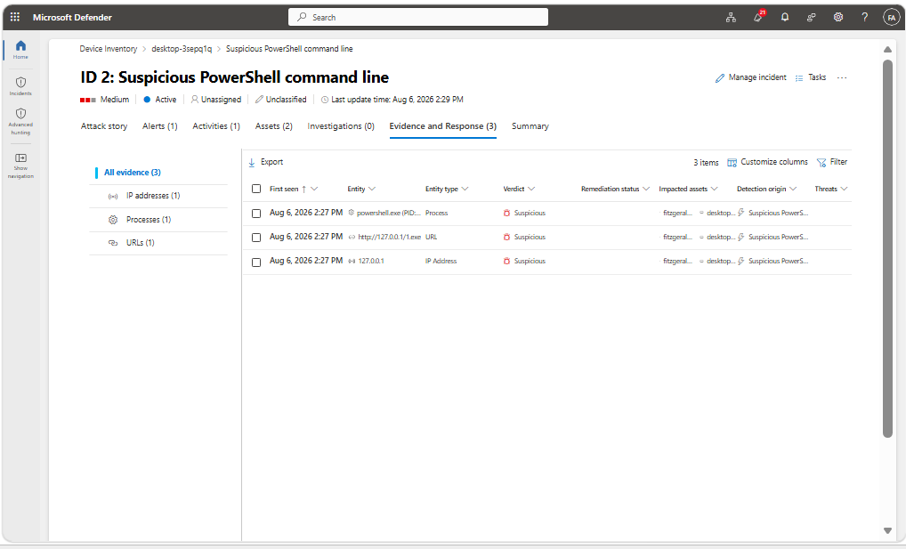

The user associated with the incident was also visible as an affected asset.

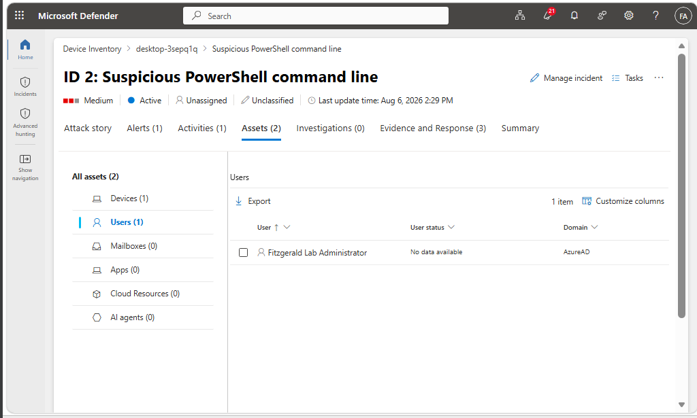

Finally, I reviewed the incident summary and management information to understand how Defender tracks an incident through its lifecycle.

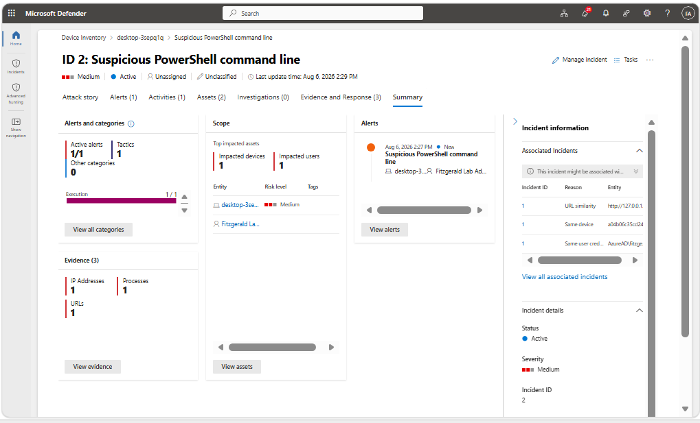

The incident remained Active and Unclassified during my review. I intentionally avoided changing its classification or taking a containment action simply to complete the exercise.

---

## 4. What Actually Mattered: Signal vs. Noise

The most meaningful observation was not simply that PowerShell appeared.

The important signal was the combination of the PowerShell command line, process relationships, localhost URL, affected endpoint, affected user, and Defender's evidence correlation.

At the same time, the process lineage showed Microsoft Defender-related components such as `MsSense.exe` and `SenseIR.exe` around some of the PowerShell activity. This was important because it showed why process context matters.

Seeing:

`powershell.exe`

by itself could lead to a quick conclusion.

Seeing:

`MsSense.exe → SenseIR.exe → powershell.exe`

creates a different question:

> Was this PowerShell activity part of Defender or controlled security activity rather than an outside compromise?

The incident also referenced `127.0.0.1`, which is the local loopback address. That means the associated connection was directed back to the same computer rather than to an external Internet host.

Together, those details supported a more cautious interpretation of the activity.

Another important observation was that many timeline events were available, but not all of them were equally useful. Repeated memory-allocation events added volume, while the process tree, command-line context, affected entities, and incident evidence provided much stronger investigative value.

---

## 5. Decision: What Made Sense Based on the Information

Based on the available information, I would not immediately isolate the endpoint or classify the activity as a confirmed malicious compromise.

The reasonable decision would be to document the findings and continue validating the activity before taking a disruptive response action.

The reasons are:

* PowerShell activity was suspicious enough to generate a Defender incident.
* The command used security-sensitive PowerShell options.
* Defender identified the process, URL, and loopback IP as suspicious evidence.
* Some surrounding process activity was connected to Microsoft Defender components.
* The observed network indicator was `127.0.0.1`, which refers to the local machine.
* There was not enough evidence in the reviewed data to conclude that an external attacker had control of the endpoint.

In a real environment, I would next confirm whether the PowerShell activity matched authorized security testing, Defender investigation activity, administrative work, or another approved process.

If that validation failed or additional malicious behavior appeared, the investigation could then move toward containment and deeper response.

---

## 6. Risks, Trade-Offs, and Limitations

One risk in this type of investigation is overreacting to a detection without understanding its context.

Immediately isolating an endpoint can reduce security risk during a confirmed compromise, but it can also interrupt legitimate business activity if the alert was caused by expected behavior.

The opposite risk also exists. Dismissing PowerShell activity too quickly because PowerShell is a legitimate Windows tool could allow malicious activity to continue.

The goal is therefore to balance security response with evidence.

This environment also does not reproduce the full scale of an enterprise SOC. There was one primary endpoint, limited identity telemetry, a small number of incidents, and no large production environment to compare against. A real investigation would likely include additional endpoint data, identity history, network telemetry, threat intelligence, asset criticality, and information from other analysts.

---

## 7. Common Beginner Mistake

A common beginner mistake is treating a suspicious process name as proof that malware is present.

For example:

> `powershell.exe` appeared, so the machine must be compromised.

That conclusion is too simple.

PowerShell is used for many legitimate tasks. What matters is how it was launched, which user ran it, what command line was used, what parent and child processes were involved, what files or connections followed, and whether the behavior matches expected activity.

Process lineage helped prevent that mistake in this investigation.

Instead of asking only:

> “Is PowerShell suspicious?”

a better question is:

> “Why did this PowerShell process run, what launched it, and what did it do?”

---

## 8. One Practical Improvement

A useful improvement would be to maintain clearer documentation for authorized testing and administrative activity.

If security tests, PowerShell automation, Defender response activity, or other controlled actions are expected, recording their time, device, user, and purpose would make later alert validation much easier.

An analyst could compare an alert against that documentation and more quickly decide whether activity is expected or requires escalation.

This would reduce investigation time without weakening security monitoring.

---

## 9. Professional Summary

This work strengthened my understanding of how Microsoft Defender XDR organizes security information from detection through investigation. I learned to move between incidents, affected assets, endpoint timelines, process relationships, and supporting evidence instead of judging activity from an alert title alone. The most important lesson was that suspicious behavior still needs context before it can be classified confidently. I also practiced making a measured response decision rather than taking an intrusive action without enough evidence.
