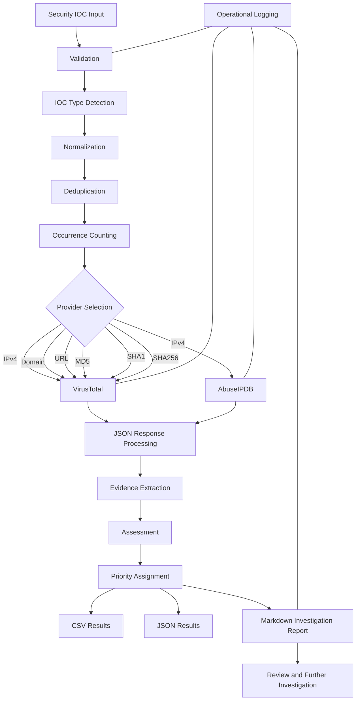

# Python Security IOC Enrichment & Investigation Toolkit

A modular Python security automation tool that validates, normalizes, deduplicates, enriches, prioritizes, and reports on Indicators of Compromise (IOCs) using live threat intelligence from VirusTotal and AbuseIPDB.

The goal of this project was to build more than a basic API lookup script. I wanted to create a complete security investigation workflow that could take raw IOC data, clean it, enrich it, turn the results into useful evidence, and produce structured output for further analysis.

---

## Table of Contents

- [Project Overview](#project-overview)
- [Why I Built This Project](#why-i-built-this-project)
- [What the Toolkit Does](#what-the-toolkit-does)
- [Investigation Workflow](#investigation-workflow)
- [Supported IOC Types](#supported-ioc-types)
- [Threat Intelligence Integrations](#threat-intelligence-integrations)
- [Provider-Aware Routing](#provider-aware-routing)
- [IOC Validation](#ioc-validation)
- [IOC Normalization](#ioc-normalization)
- [IOC Deduplication](#ioc-deduplication)
- [Threat Intelligence Enrichment](#threat-intelligence-enrichment)
- [Evidence-Based Prioritization](#evidence-based-prioritization)
- [Error Handling](#error-handling)
- [Security and API Key Protection](#security-and-api-key-protection)
- [Input Options](#input-options)
- [Generated Output](#generated-output)
- [Analyst Investigation Report](#analyst-investigation-report)
- [Application Logging](#application-logging)
- [Project Architecture](#project-architecture)
- [Project Structure](#project-structure)
- [Installation](#installation)
- [API Configuration](#api-configuration)
- [Usage](#usage)
- [Testing](#testing)
- [Lab Results](#lab-results)
- [Example Investigation Finding](#example-investigation-finding)
- [Investigation Limitations](#investigation-limitations)
- [Skills Demonstrated](#skills-demonstrated)
- [Lessons Learned](#lessons-learned)
- [Future Improvements](#future-improvements)
- [Security Disclaimer](#security-disclaimer)

---

# Project Overview

This project is a Python-based security automation toolkit designed to help process and investigate Indicators of Compromise.

The application can accept individual indicators or bulk IOC files and move them through a complete processing pipeline.

The workflow includes:

```text
IOC Input
    ↓
Validation
    ↓
IOC Type Detection
    ↓
Normalization
    ↓
Deduplication
    ↓
Occurrence Counting
    ↓
Provider-Aware Routing
    ↓
Threat Intelligence Enrichment
    ↓
JSON Response Processing
    ↓
Evidence Extraction
    ↓
Assessment
    ↓
Priority Assignment
    ↓
CSV / JSON Export
    ↓
Analyst Investigation Report
    ↓
Operational Logging
    ↓
Analyst Review
```

The application integrates with:

- VirusTotal
- AbuseIPDB

Instead of treating threat intelligence as automatic proof of malicious activity, the toolkit uses reputation information as supporting evidence.

The final investigation decision should still be based on internal endpoint, identity, network, SIEM, cloud, DNS, proxy, firewall, and other available security telemetry.

---

# Why I Built This Project

IOC investigation can involve repetitive work.

An investigation may require someone to:

1. Receive a list of indicators.
2. Determine whether each indicator is valid.
3. Identify the IOC type.
4. Remove duplicate data.
5. Search external threat intelligence services.
6. Review JSON responses.
7. Extract useful fields.
8. Compare evidence from multiple sources.
9. Determine which indicators deserve attention first.
10. Document the findings.
11. Export the results for further analysis.

Doing all of this manually can become slow when the number of indicators increases.

I built this project to automate the repetitive parts while keeping the final investigation decision with the person reviewing the evidence.

The goal was not:

```text
IOC → API → Print JSON
```

The goal was:

```text
IOC
 ↓
Validate
 ↓
Normalize
 ↓
Deduplicate
 ↓
Enrich
 ↓
Extract Evidence
 ↓
Prioritize
 ↓
Report
 ↓
Investigate
```

This creates a more useful security workflow.

---

# What the Toolkit Does

The application supports the following capabilities:

- Single IOC analysis
- TXT batch processing
- CSV batch processing
- IPv4 validation
- Domain validation
- URL validation
- MD5 validation
- SHA1 validation
- SHA256 validation
- IOC type detection
- IOC normalization
- IOC deduplication
- Occurrence counting
- VirusTotal enrichment
- AbuseIPDB enrichment
- Provider-aware API routing
- JSON response processing
- Evidence extraction
- Automated investigation prioritization
- Graceful API error handling
- CSV result generation
- JSON result generation
- Markdown investigation reporting
- Operational application logging
- Environment-based API key management
- Automated unit testing
- Modular Python architecture

---

# Investigation Workflow

The complete workflow can be represented as:



This design separates each major responsibility instead of placing the entire application inside one large script.

---

# Supported IOC Types

The toolkit recognizes the following indicator types:

| IOC Type | Example | Supported |
|---|---|---|
| IPv4 | `8.8.8.8` | Yes |
| Domain | `example.com` | Yes |
| URL | `https://example.com/` | Yes |
| MD5 | `44d88612fea8a8f36de82e1278abb02f` | Yes |
| SHA1 | 40-character SHA1 hash | Yes |
| SHA256 | 64-character SHA256 hash | Yes |

Malformed or unsupported values are rejected before unnecessary external enrichment requests are made.

---

# Threat Intelligence Integrations

## VirusTotal

VirusTotal is used for:

- IPv4 addresses
- Domains
- URLs
- MD5 hashes
- SHA1 hashes
- SHA256 hashes

The application extracts selected information from the VirusTotal response instead of requiring someone to manually work through the complete raw JSON response.

Useful fields can include:

- Provider status
- Malicious detections
- Suspicious detections
- Harmless detections
- Undetected detections
- Reputation
- Categories
- Last analysis date

---

## AbuseIPDB

AbuseIPDB is used for IPv4 reputation enrichment.

Useful fields can include:

- Abuse confidence score
- Country code
- Usage type
- ISP
- Domain
- Total reports
- Number of distinct reporting users
- Last reported date
- Public IP status

Using two providers for IPv4 addresses allows the application to collect different types of reputation evidence.

---

# Provider-Aware Routing

Not every threat intelligence provider accepts every type of IOC.

The application therefore uses provider-aware routing.

```text
IPv4
├── VirusTotal
└── AbuseIPDB

Domain
└── VirusTotal

URL
└── VirusTotal

MD5
└── VirusTotal

SHA1
└── VirusTotal

SHA256
└── VirusTotal
```

For example, an MD5 hash is not unnecessarily submitted to AbuseIPDB because AbuseIPDB is being used for IP reputation in this project.

This keeps the workflow cleaner and avoids unnecessary requests.

---

# IOC Validation

Validation occurs before threat intelligence enrichment.

The application determines whether an indicator matches one of the supported IOC types.

Examples:

```text
8.8.8.8
```

Result:

```text
Valid IPv4
```

---

```text
example.com
```

Result:

```text
Valid Domain
```

---

```text
https://example.com/
```

Result:

```text
Valid URL
```

---

```text
44d88612fea8a8f36de82e1278abb02f
```

Result:

```text
Valid MD5
```

Invalid input is also detected.

For example:

```text
999.999.999.999
```

is not accepted as a valid IPv4 address.

Likewise:

```text
not-an-ioc
```

is rejected as unsupported input.

This prevents unnecessary API requests for data that can already be identified as invalid locally.

---

# IOC Normalization

Valid indicators are normalized before deduplication.

For example:

```text
EXAMPLE.COM
Example.com
example.com
```

all represent the same domain.

The application normalizes the domain to:

```text
example.com
```

Hash values are also normalized to lowercase.

Normalization is important because inconsistent formatting should not cause the same logical IOC to be treated as multiple investigation targets.

---

# IOC Deduplication

After normalization, duplicate indicators are consolidated.

For example, the test data contained:

```text
8.8.8.8
8.8.8.8
```

Instead of performing the same enrichment twice, the application processes one unique indicator and records:

```text
occurrence_count = 2
```

The same concept applies to:

```text
EXAMPLE.COM
example.com
```

After normalization, both values become:

```text
example.com
```

This creates the following process:

```text
Raw Input
    ↓
Normalization
    ↓
Deduplication
    ↓
Occurrence Counting
    ↓
Enrichment
```

This is especially useful when working with APIs that have request quotas.

---

# Threat Intelligence Enrichment

After an IOC has been validated, normalized, and deduplicated, the application sends it to the appropriate threat intelligence provider.

The application then processes the JSON response and extracts selected information.

This changes the workflow from:

```text
API Response
    ↓
Large Raw JSON
```

into:

```text
API Response
    ↓
JSON Parsing
    ↓
Selected Security Evidence
    ↓
Assessment
    ↓
Priority
    ↓
Readable Report
```

This makes the information easier to review.

---

# Evidence-Based Prioritization

The toolkit includes an assessment module that uses available threat intelligence evidence to assign investigation priorities.

The priority structure is:

| Priority | Assessment |
|---|---|
| Priority 1 | High-priority negative reputation |
| Priority 2 | Suspicious - investigation recommended |
| Priority 3 | No significant negative intelligence observed |
| Priority 4 | Insufficient intelligence |
| Priority 5 | Invalid IOC |

Examples of evidence used during assessment include:

- VirusTotal malicious detections
- VirusTotal suspicious detections
- AbuseIPDB abuse confidence score
- Provider availability

The application intentionally uses careful language.

A Priority 1 IOC does **not** automatically mean:

```text
Confirmed compromise
```

It means the available reputation evidence is strong enough to justify high investigation priority.

---

# Error Handling

External APIs are dependencies that can fail.

The application was designed to handle conditions such as:

```text
success
unavailable
authentication_error
not_found
rate_limited
provider_error
timeout
network_error
invalid_json
```

The goal is graceful failure.

For example, if VirusTotal becomes unavailable, the application should not lose every other result in the investigation.

Instead, the provider status is recorded and processing can continue where possible.

This design was tested before the real API credentials were configured.

The application was still able to generate:

- CSV output
- JSON output
- Markdown reporting
- Operational logs

even when external enrichment was unavailable.

---

# Security and API Key Protection

The application uses API credentials for VirusTotal and AbuseIPDB.

The real credentials are stored in:

```text
.env
```

The credentials are loaded through environment variables instead of being hardcoded into the Python source files.

A safe template is included as:

```text
.env.example
```

Example:

```text
VT_API_KEY=your_virustotal_api_key_here
ABUSEIPDB_API_KEY=your_abuseipdb_api_key_here
```

The real `.env` file should never be committed to GitHub.

The project uses `.gitignore` rules to exclude sensitive and unnecessary files.

Examples include:

```text
.env
.venv/
__pycache__/
*.pyc
logs/*.log
results/*.csv
results/*.json
reports/*.md
```

Generated results can contain investigation information, so sanitized examples should be used when sharing output publicly.

---

# Input Options

The toolkit supports multiple ways to provide indicators.

## Single IOC

Example:

```bash
python -m src.main --ioc 8.8.8.8
```

---

## TXT File

Example:

```bash
python -m src.main --file sample-data/sample_iocs.txt
```

Example input:

```text
8.8.8.8
EXAMPLE.COM
example.com
https://example.com/
44d88612fea8a8f36de82e1278abb02f
999.999.999.999
not-an-ioc
8.8.8.8
```

---

## CSV File

Example:

```bash
python -m src.main --file sample-data/sample_iocs.csv
```

Example:

```csv
indicator
8.8.8.8
EXAMPLE.COM
example.com
https://example.com/
44d88612fea8a8f36de82e1278abb02f
999.999.999.999
not-an-ioc
8.8.8.8
```

---

# Generated Output

The application generates several forms of output.

```text
results/
├── *.csv
└── *.json

reports/
└── *.md

logs/
└── ioc_tool.log
```

Each output format serves a different purpose.

---

## CSV

CSV provides flattened investigation data that can be opened in spreadsheet or data-analysis software.

Example fields include:

```text
indicator
indicator_type
valid
occurrence_count
vt_status
vt_malicious
vt_suspicious
abuse_status
abuse_confidence
abuse_reports
country
assessment
priority
timestamp
```

CSV is useful for:

- Filtering
- Sorting
- Reviewing many indicators
- Additional analysis
- Importing results into other workflows

---

## JSON

JSON preserves more detailed structured investigation information.

Example structure:

```json
{
    "indicator": "8.8.8.8",
    "indicator_type": "ipv4",
    "valid": true,
    "occurrence_count": 2,
    "virustotal": {
        "provider": "VirusTotal",
        "status": "success"
    },
    "abuseipdb": {
        "provider": "AbuseIPDB",
        "status": "success"
    },
    "assessment": "No significant negative intelligence observed",
    "priority": 3
}
```

Exact reputation values can change because threat intelligence data changes over time.

JSON is useful because another application can process the structured results programmatically.

---

# Analyst Investigation Report

The toolkit automatically generates a Markdown investigation report.

The report includes sections such as:

```text
IOC Threat Intelligence Investigation Report

Investigation Summary

Prioritized Findings

Supporting Evidence

Recommended Next Step

Investigation Limitation
```

A finding can include:

```text
Indicator
IOC Type
Validation Status
Occurrence Count
Assessment
Priority
VirusTotal Status
VirusTotal Malicious Detections
VirusTotal Suspicious Detections
AbuseIPDB Status
Abuse Confidence Score
Report Count
Supporting Evidence
Recommended Investigation Step
```

The report is designed to turn structured enrichment data into something that can be reviewed more quickly.

---

# Application Logging

The toolkit maintains an operational log at:

```text
logs/ioc_tool.log
```

The log can record events such as:

```text
Started IOC analysis
Processing IOC
Validated IOC
Invalid IOC detected
IOC analysis completed successfully
```

Logging and reporting solve different problems.

```text
Application Log
    ↓
What did the program do?
```

```text
Investigation Report
    ↓
What did we learn about the indicators?
```

Both are useful for understanding the complete workflow.

---

# Project Architecture

The project was built using separate modules for different responsibilities.

This helps avoid creating one large script that handles everything.

The main areas are separated into:

```text
Input Processing
        ↓
Validation
        ↓
Normalization
        ↓
Provider Integrations
        ↓
Assessment
        ↓
Exporting
        ↓
Reporting
        ↓
Logging
```

Additional architecture documentation is available in:

```text
docs/architecture.md
```

---

# Project Structure

A simplified project structure is shown below:

```text
python-security-ioc-toolkit/
│
├── docs/
│   ├── architecture.md
│   ├── limitations.md
│   └── lessons-learned.md
│
├── logs/
│   └── ioc_tool.log
│
├── providers/
│   ├── abuseipdb.py
│   └── virustotal.py
│
├── reports/
│   └── generated investigation reports
│
├── results/
│   ├── generated CSV results
│   └── generated JSON results
│
├── sample-data/
│   ├── sample_iocs.txt
│   └── sample_iocs.csv
│
├── sample-output/
│   └── sanitized example results
│
├── screenshots/
│   └── project screenshots
│
├── src/
│   ├── application modules
│   ├── validation logic
│   ├── normalization logic
│   ├── assessment logic
│   ├── exporting logic
│   └── reporting logic
│
├── tests/
│   └── automated tests
│
├── .env.example
├── .gitignore
├── README.md
└── requirements.txt
```

> The real `.env` file is intentionally excluded from the repository.

---

# Installation

## 1. Clone the Repository

```bash
git clone <repository-url>
```

Move into the project:

```bash
cd python-security-ioc-toolkit
```

---

## 2. Create a Python Virtual Environment

```bash
python3 -m venv .venv
```

---

## 3. Activate the Virtual Environment

Linux:

```bash
source .venv/bin/activate
```

---

## 4. Install Dependencies

```bash
pip install -r requirements.txt
```

---

# API Configuration

Create a private `.env` file based on `.env.example`.

Example:

```text
VT_API_KEY=your_virustotal_api_key
ABUSEIPDB_API_KEY=your_abuseipdb_api_key
```

Do not place real API keys directly inside the source code.

Do not commit the `.env` file.

---

# Usage

## Analyze a Single IOC

```bash
python -m src.main --ioc 8.8.8.8
```

---

## Analyze a TXT File

```bash
python -m src.main --file sample-data/sample_iocs.txt
```

---

## Analyze a CSV File

```bash
python -m src.main --file sample-data/sample_iocs.csv
```

---

# Testing

The project includes automated unit tests.

Run the complete test suite with:

```bash
python -m unittest discover tests -v
```

During final project testing:

```text
Ran 10 tests
OK
```

The tests covered areas such as:

- Valid IPv4 recognition
- Invalid IPv4 rejection
- Domain validation
- Domain normalization
- URL validation
- MD5 validation
- SHA1 validation
- SHA256 validation
- Invalid hash handling

---

## Python Syntax Verification

The project source can also be checked with:

```bash
python -m py_compile src/*.py providers/*.py
```

A successful run returns to the terminal without a Python syntax error.

---

## JSON Verification

Generated JSON output can be checked with:

```bash
python -m json.tool <result-file>.json
```

During final testing, the exported result passed JSON validation.

---

# Lab Results

The completed lab successfully demonstrated the full IOC processing workflow.

The test dataset contained:

```text
8 raw input rows
```

After normalization and deduplication:

```text
6 unique investigation targets
```

The application successfully demonstrated:

- IOC validation
- IOC type detection
- Domain normalization
- Hash normalization
- Duplicate detection
- Occurrence counting
- Invalid IOC rejection
- Live VirusTotal communication
- Live AbuseIPDB communication
- Provider-aware routing
- JSON response parsing
- Evidence extraction
- Investigation prioritization
- CSV export
- JSON export
- Markdown reporting
- Operational logging
- Secure API credential management
- Automated unit testing

A live IPv4 test using:

```text
8.8.8.8
```

successfully received enrichment from both:

```text
VirusTotal → success
AbuseIPDB → success
```

This verified that the application could communicate with two external threat intelligence services and process the returned information.

---

# Example Investigation Finding

One of the strongest test findings involved the MD5 hash:

```text
44d88612fea8a8f36de82e1278abb02f
```

The application identified it as:

```text
Type: MD5
Valid: True
```

VirusTotal enrichment returned:

```text
Malicious detections: 63
```

The assessment module converted the available evidence into:

```text
Assessment: High-priority negative reputation
Priority: 1
```

Supporting evidence:

```text
VirusTotal reported 63 malicious detections
```

This demonstrated the difference between collecting threat intelligence and turning that information into an investigation priority.

The application did **not** automatically claim:

```text
Endpoint compromised
```

Instead, the result indicated that the IOC had strong negative external reputation and should receive high investigation priority if discovered in an internal environment.

---

# How I Would Continue the Investigation

If a high-priority IOC were discovered inside a real environment, external reputation would only be the beginning of the investigation.

I would next correlate the IOC with internal security telemetry.

Possible sources could include:

```text
EDR
SIEM
Endpoint logs
Process execution telemetry
File creation events
DNS logs
Proxy logs
Firewall logs
Network telemetry
Identity logs
Email security data
Cloud security telemetry
```

Questions to answer would include:

```text
Does the IOC exist internally?

Which endpoint observed it?

Which user was involved?

Did the file execute?

What process created or launched it?

What was the parent process?

Were child processes created?

Did the process establish network connections?

Was persistence created?

Were credentials accessed?

Did similar activity occur on other systems?

Was data accessed or transferred?
```

The investigation flow would become:

```text
Threat Intelligence Finding
            ↓
Search Internal Telemetry
            ↓
Identify Affected Systems
            ↓
Build Activity Timeline
            ↓
Analyze Process / Network / Identity Evidence
            ↓
Determine Scope
            ↓
Contain and Remediate if Required
            ↓
Final Incident Classification
```

---

# Investigation Limitations

Threat intelligence enrichment has important limitations.

A malicious reputation result does not automatically prove that an endpoint or environment has been compromised.

Likewise, a clean reputation result does not prove that an IOC is safe.

Threat intelligence provider coverage can vary.

Reputation can also change over time.

IP reputation can be affected by:

- Shared hosting
- VPN services
- Cloud infrastructure
- Proxy services
- NAT
- Changes in ownership

Domain and URL ownership or behavior can also change.

External intelligence does not automatically explain:

- Which endpoint observed an IOC
- Which process contacted an IOC
- Whether a file executed
- Whether persistence occurred
- Whether credentials were accessed
- Whether lateral movement occurred
- Whether data was exfiltrated

Final investigation decisions should use internal telemetry whenever it is available.

Additional limitations are documented in:

```text
docs/limitations.md
```

---

# Skills Demonstrated

This project combines programming, security automation, investigation, threat intelligence, and secure development concepts.

## Python Development

- Python 3
- Modular programming
- Functions
- Imports
- Dictionaries
- Lists
- File handling
- Exception handling
- Command-line arguments
- Environment variables
- Logging
- Unit testing

---

## Security Automation

- IOC validation
- IOC classification
- IOC normalization
- IOC deduplication
- Occurrence counting
- Threat intelligence enrichment
- Provider-aware routing
- Automated evidence extraction
- Investigation prioritization
- Structured reporting

---

## API Integration

- REST API communication
- HTTPS requests
- Authentication headers
- JSON processing
- HTTP status handling
- Rate-limit handling
- Timeout handling
- Network error handling
- Provider error handling

---

## Threat Intelligence

- IP reputation
- Domain reputation
- URL reputation
- File hash reputation
- VirusTotal
- AbuseIPDB
- Multi-source enrichment
- Reputation interpretation

---

## Investigation and Analysis

- Evidence review
- IOC prioritization
- Supporting evidence documentation
- Investigation scoping
- Internal telemetry correlation planning
- Distinguishing reputation from confirmed compromise

---

## Data Processing

- TXT ingestion
- CSV ingestion
- CSV exporting
- JSON parsing
- JSON exporting
- Data normalization
- Deduplication
- Structured data processing

---

## Secure Development

- API secret protection
- `.env` configuration
- `.env.example`
- `.gitignore`
- File permissions
- Dependency isolation
- Input validation
- Error handling
- Modular design
- Automated testing

---

## Documentation

- Technical README
- Architecture documentation
- Limitations documentation
- Lessons learned
- Investigation reporting
- Structured evidence documentation

---

# Lessons Learned

## 1. Validate Before Enrichment

Malformed or unsupported indicators should be detected before external API requests are attempted.

This reduces unnecessary requests and keeps the data cleaner.

---

## 2. Normalize Before Deduplication

Values such as:

```text
EXAMPLE.COM
```

and:

```text
example.com
```

should not become separate investigation targets.

Normalization should happen before duplicate checking.

---

## 3. Deduplication Protects API Quota

Repeated indicators do not need repeated enrichment requests.

Occurrence counts can preserve the original context without wasting API requests.

---

## 4. External APIs Can Fail

Security automation should expect:

- Missing credentials
- Authentication problems
- Missing reports
- Rate limits
- Timeouts
- Network failures
- Provider failures
- Unexpected data

The rest of the workflow should continue whenever possible.

---

## 5. Raw JSON Is Not the Final Product

Threat intelligence APIs can return large responses.

The important part is extracting fields that support investigation.

The project therefore follows:

```text
Raw JSON
    ↓
Field Extraction
    ↓
Evidence
    ↓
Assessment
    ↓
Priority
    ↓
Report
```

---

## 6. Threat Intelligence Does Not Equal Compromise

This was one of the most important lessons from the project.

Threat intelligence can show that an indicator has negative reputation.

It cannot automatically prove that an organization's endpoint, account, network, or cloud environment was compromised.

Internal evidence is still required.

---

## 7. Logging and Reporting Solve Different Problems

Operational logs answer:

```text
What did the application do?
```

Investigation reports answer:

```text
What did we learn?
```

A useful security application can benefit from both.

---

## 8. Modular Design Makes the Application Easier to Maintain

Separating validation, normalization, provider integrations, assessment, exporting, reporting, and configuration makes the project easier to:

- Understand
- Test
- Troubleshoot
- Modify
- Expand

---

## 9. Automation Should Support Human Analysis

The application can automate repetitive tasks.

It can:

```text
Validate
Normalize
Deduplicate
Enrich
Parse
Prioritize
Export
Report
Log
```

The final decision still requires evidence review and judgment.

---

# Future Improvements

Possible future improvements include:

## Local IOC Caching

Store recent enrichment results locally so repeated indicators do not always require another API request.

---

## Improved Rate-Limit Management

Add controlled request scheduling and provider-aware retry logic while continuing to respect API provider limits.

---

## Additional Threat Intelligence Providers

The modular provider design could be expanded to support additional threat intelligence sources.

---

## SIEM Integration

Results could be sent into a SIEM or security data platform for correlation with internal events.

---

## EDR Correlation

High-priority file hashes, domains, URLs, and IP addresses could be compared with endpoint telemetry.

---

## Additional Input Formats

The application could support other structured input formats or direct event ingestion.

---

## Investigation Timeline Generation

Future versions could combine IOC evidence with timestamped endpoint or network events to help build investigation timelines.

---

## Automated Testing Expansion

Additional tests could cover:

- API response parsing
- Provider failures
- HTTP 429 responses
- Authentication failures
- Timeout behavior
- Export generation
- Report generation
- Scoring logic

---

## Continuous Integration

Automated testing could be added to a CI workflow so tests run automatically when changes are pushed to the repository.

---

## Additional Reporting

Future versions could generate other report formats or dashboards for easier review.

---

# Main Design Principle

The most important principle behind this project is:

> **Threat intelligence is supporting evidence, not automatic proof of compromise.**

The toolkit is designed to help organize information and determine what deserves attention.

The complete investigation process should still follow:

```text
External Intelligence
        ↓
IOC Prioritization
        ↓
Internal Telemetry Search
        ↓
Evidence Correlation
        ↓
Scope Determination
        ↓
Final Investigation Decision
```

This keeps the automation useful without allowing the application to make conclusions that the available evidence cannot support.

---

# Documentation

Additional project documentation includes:

```text
docs/architecture.md
docs/limitations.md
docs/lessons-learned.md
```

These documents provide more detail about:

- Application architecture
- Provider routing
- Reliability
- Investigation limitations
- Design decisions
- Lessons learned

---

# Security Disclaimer

This project was created for defensive cybersecurity learning, security automation, threat intelligence enrichment, and investigation practice.

External reputation information should not be used as the only reason to declare an endpoint, account, network, or environment compromised.

Threat intelligence findings should be correlated with internal evidence whenever possible.

API credentials should never be committed to a public repository.

---

# Final Project Summary

This project started with a simple question:

> How can repetitive IOC enrichment be turned into a structured and safer investigation workflow?

The final toolkit grew into a modular Python application capable of:

```text
IOC Ingestion
    ↓
Validation
    ↓
Type Detection
    ↓
Normalization
    ↓
Deduplication
    ↓
Occurrence Counting
    ↓
Provider-Aware Enrichment
    ↓
VirusTotal + AbuseIPDB
    ↓
JSON Processing
    ↓
Evidence Extraction
    ↓
Assessment
    ↓
Prioritization
    ↓
CSV + JSON Export
    ↓
Analyst Reporting
    ↓
Operational Logging
    ↓
Further Investigation
```

During testing, the application successfully processed mixed IOC data, reduced eight raw rows to six unique investigation targets, rejected invalid indicators, completed live enrichment through VirusTotal and AbuseIPDB, and identified a Priority 1 MD5 reputation finding based on 63 VirusTotal malicious detections.

The project gave me practical experience connecting Python development with security analysis, threat intelligence, API integration, data processing, secure credential management, testing, logging, and investigation reporting.

Most importantly, it reinforced that good security automation should not simply produce more data.

It should help turn data into organized evidence that can support a better investigation.
